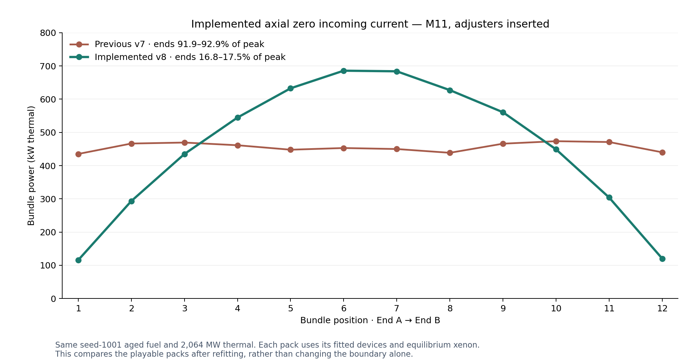

# V8 axial Marshak acceptance

The [implementation record](../../docs/physics/axial-marshak-v8.md) describes the
boundary equation, explicit common production normalization, device refit and
validation scope.



The final refitted pack's M11 end bundles are approximately 17% of peak, compared
with 92–93% in v7. All profiles are shared Core calculations with inserted rods,
the same seed-1001 aged fuel and total 2,064 MW thermal. Each calibrated pack has
its own device strengths and equilibrium xenon.

| Campaign | Outcome |
| --- | --- |
| Fixed two oldest channels/day | Accepted low-LZC ending on day 76 |
| Two oldest channels; add a third below 45% LZC | 100 days completed; 226 moves; 1,808 bundles; 2,304.752 points; final LZC 46.30% |

The feedback policy is an automated player decision based on a published
boundary reading. There are no power, inventory, scoring or physics overrides.
Native campaigns use the versioned Browser bridge, not a 100-day browser UI run.

Artifacts:

- [Completed campaign](oldest-lzc-seed1001.json), [telemetry](oldest-lzc-seed1001.jsonl), [exact commands](oldest-lzc-seed1001-commands.jsonl)
- [Fixed-policy ending](oldest-2-seed1001.json)
- [New channel reference](channel-reference.json)
- [M11 absorption](bundle-absorption.png), [data](bundle-absorption.json), [CSV](bundle-absorption.csv)
- [M11 power, adjusters in/out](bundle-power-adjusters.png), [data](bundle-power-adjusters.json), [CSV](bundle-power-adjusters.csv)
- [Before/after vector figure](m11-before-after.svg)
- [Browser daily acceptance](browser-acceptance.json), [display acceptance](display-acceptance.json), [cold/warm reproduction](reproduction.json)

The final repository scripts passed 130 Core, 81 Game, 45 Browser and 172 frontend
tests. The production AOT WASM `/CRS/` browser path passed default daily turns,
terminal feedback, offline save/replay and narrow layout. All twelve reproduction
rows matched across cold/warm samples, with no reported browser errors.

Reproduce the feedback campaign using a new output prefix:

```powershell
dotnet run --project tools/LongRunPlaytest -c Release -- --pacing=daily-turn --policy=oldest-lzc --channels-per-day=2 --days=100 --seed=1001 --output=tmp/v8-oldest-lzc-seed1001
```
