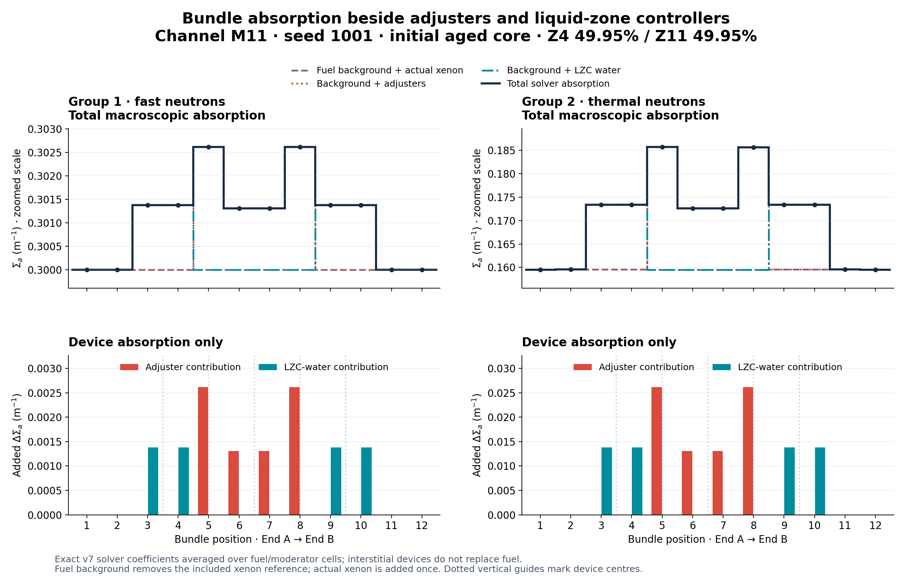
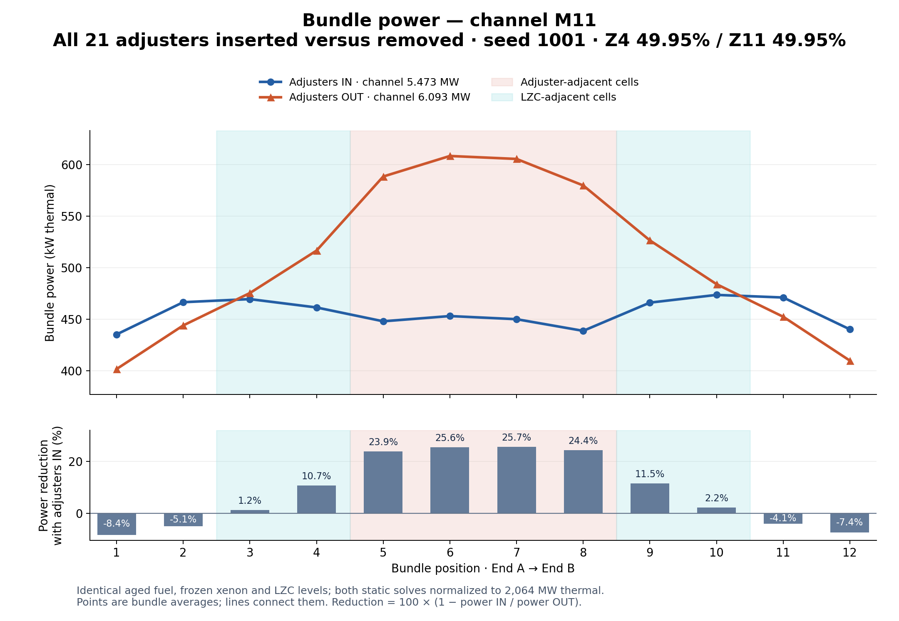

# Bundle absorption beside adjusters and LZC tubes



Channel **M11**, index 200, from the initial seed-1001 aged browser core using
`candu6-two-group-diffusion-v1-lzc-tubes-v7`. It overlaps adjusters 4, 11 and 18,
and LZC compartments Z4/Z11 at 49.946195% fill.

The top row plots fast/thermal macroscopic absorption for all 12 bundles, with
fuel-plus-actual-xenon background, device additions and exact solver totals.
Axes are zoomed and labelled. The bottom row isolates device increments on
zero-based axes. Coefficients are homogenized fuel/moderator-cell averages in
m⁻¹, including interstitial device overlaps; they are not microscopic material
cross sections in barns.

| Device | Affected one-based bundle positions | Thermal addition |
| --- | --- | --- |
| LZC water, Z4 | 3, 4 | 0.013826823 m⁻¹ each |
| Adjuster 4 | 5 | 0.026156757 m⁻¹ |
| Adjuster 11 | 6, 7 | 0.013078379 m⁻¹ each |
| Adjuster 18 | 8 | 0.026156757 m⁻¹ |
| LZC water, Z11 | 9, 10 | 0.013826823 m⁻¹ each |

Fast device additions are one tenth the thermal additions in this authored pack.
Bundle positions 1, 2, 11 and 12 receive no direct device absorption in this
channel. Their flux can still respond to diffusion from neighbouring cells.

The exporter reads the authoritative solved coefficients, the pack adjuster
overlay and the current moving-water overlay. It subtracts the included xenon
reference from fuel background before adding actual xenon, avoiding double
counting. Each component sum matches its solved total; maximum absolute error
is 3.12 × 10⁻¹⁷ m⁻¹. CSV values retain full precision.

- [Raw data and provenance](bundle-absorption.json)
- [Per-bundle CSV](bundle-absorption.csv)
- [Vector plot](bundle-absorption.svg)
- [Plot source](plot_absorption.py)

Reproduce from the repository root:

```powershell
dotnet run --project tools/AgedCoreBenchmark -c Release -- --bundle-absorption benchmarks/bundle-absorption-2026-10-10/bundle-absorption.json 1001
python -X utf8 benchmarks/bundle-absorption-2026-10-10/plot_absorption.py
```

## Bundle power with adjusters in and out



This comparison removes all 21 adjusters in an offline clone of the pack. The
same initial seed-1001 bundle inventory, actual xenon and its included reference,
all fourteen LZC fills (49.946195%), leakage and fission coefficients are used
in both solves. No controller compensation or time advance occurs. Both solves
normalize to **2,064 MW thermal**. Solver tolerances are tightened identically.
All 4,560 node coefficients are checked: only adjuster absorption differs.

M11 totals **5.472541 MW with adjusters in** and **6.092679 MW with adjusters out**.
Inserted adjusters reduce the combined power of directly overlapping bundles
5–8 by **24.902%**. End bundles increase with adjusters in as the fixed core
output is redistributed, so the effect is not a uniform scaling of every bundle.
The measured whole-core adjuster worth is 16.999887 mk; both residuals are below
2 × 10⁻⁷. Exact powers and per-bundle reductions are available in the CSV.

- [Controlled solve data](bundle-power-adjusters.json)
- [Power comparison CSV](bundle-power-adjusters.csv)
- [Vector power plot](bundle-power-adjusters.svg)
- [Power plot source](plot_power_adjusters.py)

```powershell
dotnet run --project tools/AgedCoreBenchmark -c Release -- --bundle-power-adjusters benchmarks/bundle-absorption-2026-10-10/bundle-power-adjusters.json 1001 200
python -X utf8 benchmarks/bundle-absorption-2026-10-10/plot_power_adjusters.py
```
