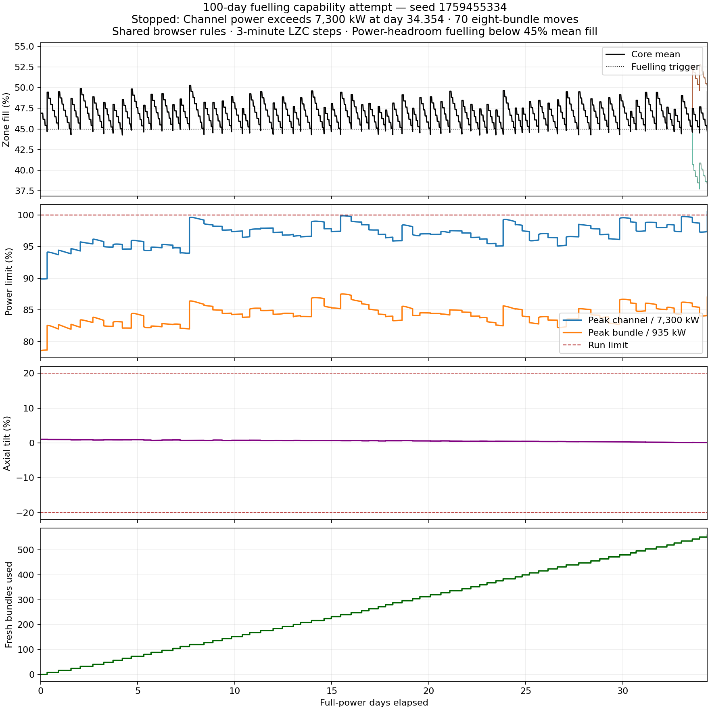
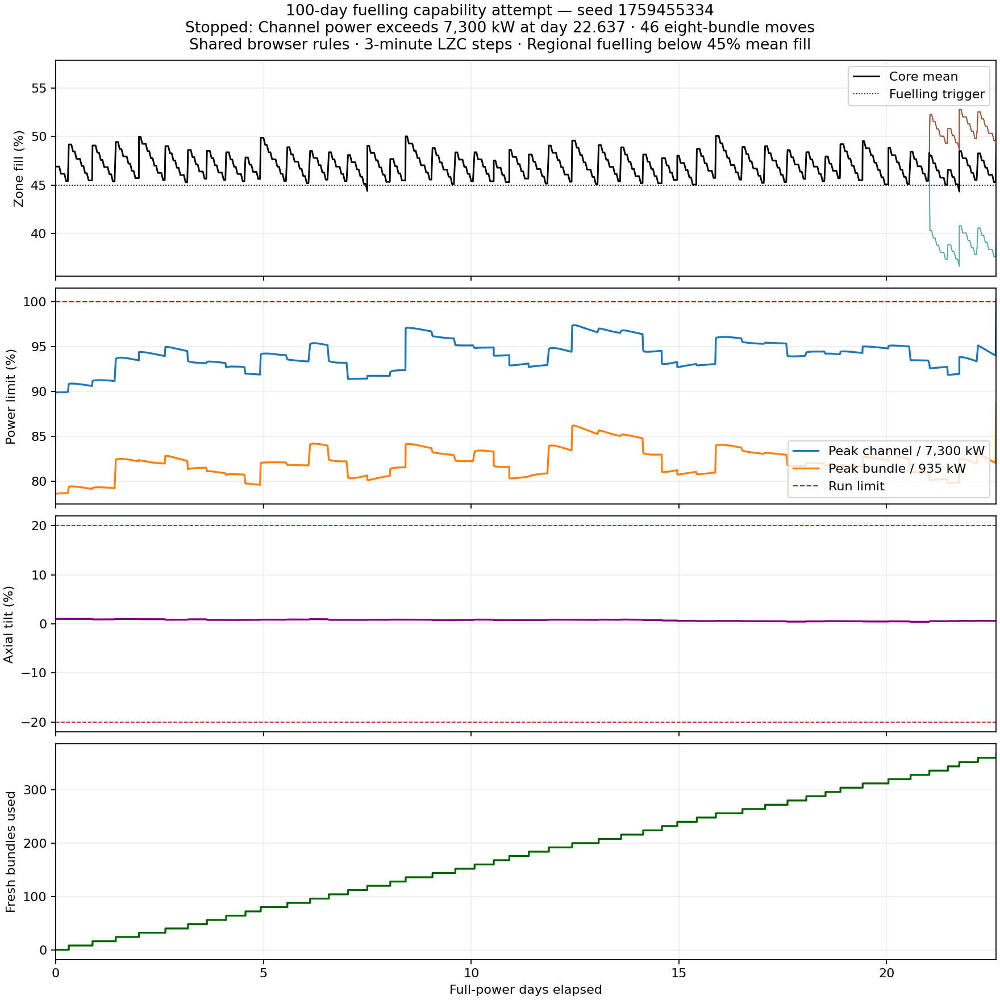

# 100-day fuelling capability attempts — 2026-10-06

Neither tested policy reached the requested 100 full-power days. Both attempts
ended on the normal 7,300 kW channel-power limit after an accepted fuel move.
A successful 100-day run remains unverified.

Both runs used seed **1759455334**, initially drawn from cryptographic randomness,
and the authoritative endless browser-factory `GameSession` at 100% full power:
2,064 MW thermal / 650 MW electrical. The active pack was
`candu6-two-group-diffusion-v1-cycle190-650mwe-reactivity-v3`.
Xenon, three-minute spatial/LZC solves, unlimited fuel and all normal terminal
limits remained active. There were no physics, inventory or horizon overrides.
The shared simulation source was committed in `6930967`.

| Policy | Ending day | Eight-bundle moves | Fresh bundles | Highest observed channel kW | Highest observed bundle kW | Ending mean LZC | Ending axial tilt |
| --- | ---: | ---: | ---: | ---: | ---: | ---: | ---: |
| Oldest eligible fuel in the lowest-fill region when regional fills differ | 22.6375 | 46 | 368 | 7,333.035 | 829.079 | 49.269% | +0.603% |
| Existing power-deficit / fresh-fuel-headroom policy | 34.3542 | 70 | 560 | 7,340.909 | 818.316 | 49.500% | +0.137% |

The longer run ended when **L14** reached 7,340.909 kW after refuelling **J14**.
J14 itself reached 6,991.218 kW: the limit violation occurred elsewhere in the
coupled core. The longer run delivered 1,701,768 MWh thermal and an estimated
535,925 MWh electrical. Its final score was 597.044 points; fuel use averaged
about 16.3 fresh bundles/day. These two policies on this seed are the tested
scope; the results do not establish the outcome of other policies or seeds.

The regional tool checks power and fuel accounting after every three-minute
advance and fuel move, and retains hourly observations plus all fuel moves.
The existing power-headroom tool requests 10x playback: Game still integrates,
solves LZC and checks ending conditions at every internal three-minute boundary.
Its saved observations are half-hour snapshots plus instantaneous fuel moves;
its reported extrema are observed snapshot extrema. The legacy report's
time-weighted ripple estimates use half-hour left-held samples; Game's score and
energy totals remain authoritative at the three-minute integration cadence.

Calculation cost increased as individual zone fills became nonuniform. The
regional run took 994.85 s; the power-headroom run took 653.71 s on the local
native Release runtime. The longer run averaged roughly 14.6 wall seconds/day
through day 33; day 34 took roughly 95 seconds. Live diagnostics placed the extra
work in spatial equilibrium candidate solving. These native measurements do not
measure the deployed AOT WASM runtime.

An initial oldest-channel-only baseline was stopped for policy comparison after
its day-23 checkpoint. It was not counted as a completed or terminal 100-day
attempt. Its local artifact remains in
`artifacts/fuelling-100-days-oldest-baseline/report.json`.

## Saved evidence

- [Regional report](regional-report.json) and [plot](regional.png).
- [Power-headroom report](reserve-report.json), [snapshot trace](reserve-report.jsonl)
  and [plot](reserve.png).





## Reproduce

```powershell
dotnet run --project tools/AgedCoreBenchmark -c Release -- --fuelling-100-days artifacts/fuelling-100-days-balanced 1759455334
dotnet run --project tools/LongRunPlaytest -c Release -- --endless=true --days=100 --seed=1759455334 --threshold=.45 --policy=reserve --output=artifacts/fuelling-100-days-reserve
python tools/AgedCoreBenchmark/plot-fuelling-capability.py benchmarks/fuelling-capability-2026-10-06/regional-report.json
python tools/AgedCoreBenchmark/plot-fuelling-capability.py benchmarks/fuelling-capability-2026-10-06/reserve-report.json
```

## Browser seed change and validation

Initial browser loading, New aged core, New shift, Try new seed and the objective
switch now draw a cryptographically random unsigned 32-bit seed. A draw equal to
the current seed is retried. Explicit seed entry, saved-run restoration and
Retry same seed remain reproducible. Fixed calibration/fixture seeds such as
1001 remain intentional; they no longer choose the default browser starting core.

`tools/Test-Browser.ps1` passed all 37 shared bridge tests, 149 frontend tests and
the production frontend build. The final Studio wording change passed its 25
focused tests and the Pages build. The local Pages smoke path passed random
starts, same-seed retries, accepted refuelling, challenge completion, state/history
lifecycle, fresh-fuel poison checks and responsive layouts. The explicit-seed
WASM reproduction matrix matched all six rows across two samples with no browser
console/page errors. The benchmark tool built with zero warnings/errors.
