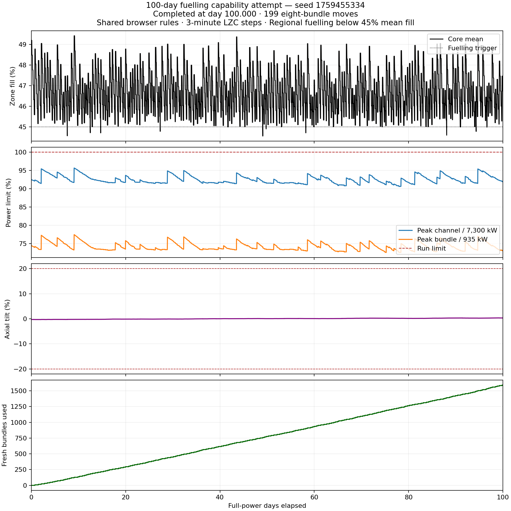
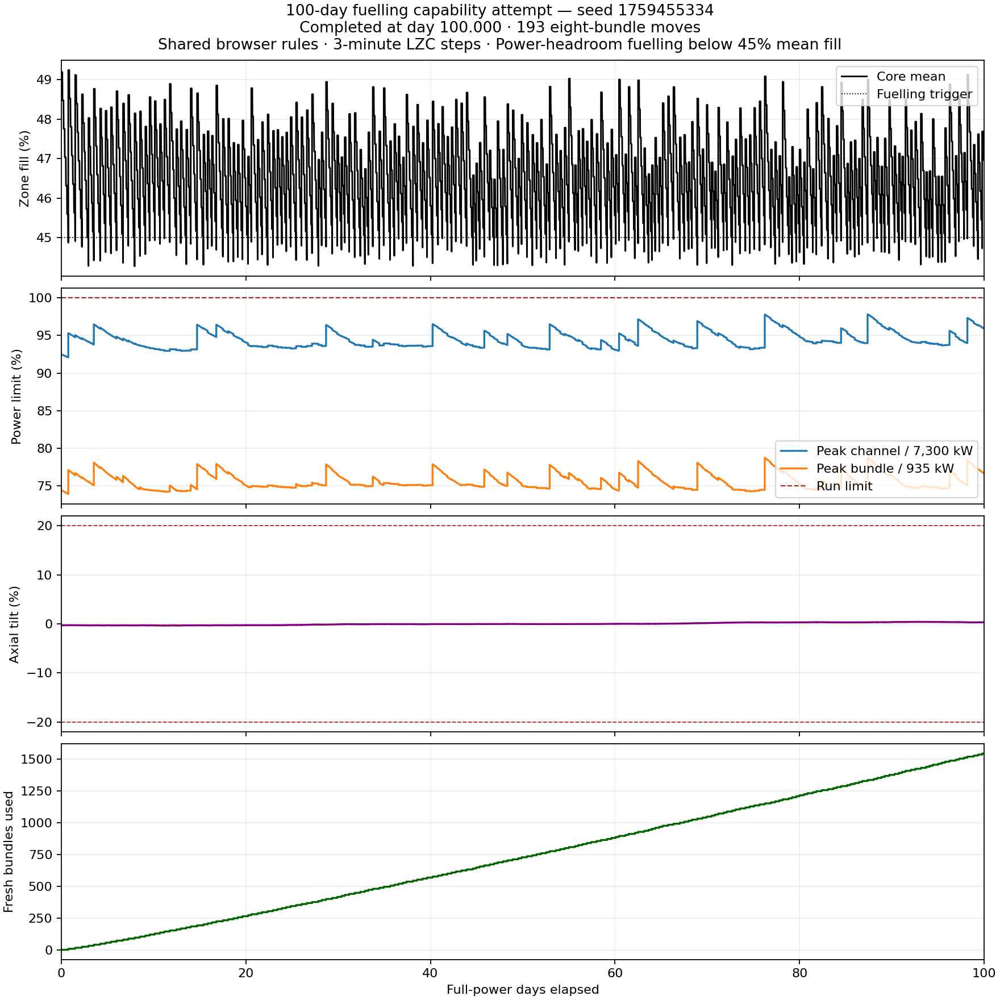

# 100-day fuelling capability rerun — 2026-10-07

Both previously tested policies completed **100 full-power days** with the current
`candu6-two-group-diffusion-v1-literature-geometry-v4` calibration. Neither run
ended on a normal limit. This repeats seed **1759455334** and the two existing
player policies from the [6 October attempts](../fuelling-capability-2026-10-06/README.md).

The authoritative endless browser-factory GameSession ran at 100% power
(2,064 MW thermal / 650 MW electrical), with xenon, three-minute spatial/LZC
updates, unlimited fresh fuel and all normal terminal limits active. No physics,
inventory or horizon overrides were applied. The benchmark rerun changed no
simulation code or calibration settings.

| Metric | Regional / oldest eligible fuel | Power-headroom (`reserve`) |
| --- | ---: | ---: |
| Completed full-power days | 100 | 100 |
| Terminal violation | None | None |
| Eight-bundle moves | 199 | 193 |
| Fresh bundles consumed | 1,592 | 1,544 |
| Fresh bundles/day | 15.92 | 15.44 |
| Highest observed channel power, kW | 6,984.151 | 7,140.939 |
| Highest observed bundle power, kW | 723.952 | 736.222 |
| Minimum mean LZC, % | 44.275 | 44.272 |
| Maximum mean LZC, % | 49.412 | 49.245 |
| Ending mean LZC, % | 46.736 | 46.967 |
| Maximum absolute axial tilt, % | 0.354 | 0.407 |
| Ending axial tilt, % | +0.324 | +0.314 |
| Final score, points | 2,316.757 | 2,281.698 |
| Native Release wall time, seconds | 2,830.072 | 2,166.710 |

The reserve run's authoritative energy totals are **4,953,600 MWh thermal** and
**1,560,000 MWh estimated electrical**, exactly 100 days at the configured output.
It used 48 fewer fresh bundles than the regional policy, with a higher observed
channel peak and a lower final score.

The previous v3 calibration ended at day 22.6375 for the regional policy and day
34.3542 for the reserve policy. These results show that both policies can reach
100 days on this seed with v4. They do not establish performance for other seeds,
policy optimality, or a realistic plant fuelling response. The existing calibration
and poison-basis limitations are documented in
[literature geometry v4](../../docs/physics/literature-geometry-v4.md).

## Measurement and verification

The regional tool advanced and checked power/fuel accounting after all **48,000**
three-minute steps and every fuel move. It saved 2,601 hourly, move and final
observations. The reserve tool requested 10x playback; shared Game still solved
and checked terminal limits at every internal three-minute boundary. Its trace
contains 4,994 initial, half-hour and instantaneous fuel-move observations.
Reserve extrema are observed snapshot extrema, rather than an export of every
internal step. Game's terminal checks still cover every internal step.

Both runs were executed sequentially on the local native Release runtime. Wall
times include the tools' observation and file-writing work; they are not deployed
AOT WASM latency measurements. No deployment was performed.

Saved-report checks passed for completion while still running, fuel/move counts,
trace ordering, fourteen-zone observations, normal observed limits, reserve energy
accounting and unchanged matching canonical/embedded pack hashes. Both benchmark
commands exited successfully. Both generated plots were visually inspected.

The source base was `e69a40af4b4f6708005f3c006ee0bd6d1b6f7043` with the existing
uncommitted v4 calibration changes. These results describe that working tree,
not the base commit alone or the published GitHub Pages deployment.
[Provenance](provenance.json) records the initial working-tree status, SDK,
commands and pack hashes; [verification](verification.json) records checks and
saved-report hashes. Existing source changes and previous benchmark artifacts
were preserved.

## Saved evidence

- [Regional report](regional-report.json) and [plot](regional.png).
- [Reserve report](reserve-report.json), [snapshot trace](reserve-report.jsonl) and [plot](reserve.png).





## Reproduce with the v4 working tree

```powershell
dotnet run --project tools/AgedCoreBenchmark -c Release -- --fuelling-100-days artifacts/fuelling-100-days-regional-2026-10-07 1759455334
dotnet run --project tools/LongRunPlaytest -c Release -- --endless=true --days=100 --seed=1759455334 --threshold=.45 --policy=reserve --output=artifacts/fuelling-100-days-reserve-2026-10-07
python tools/AgedCoreBenchmark/plot-fuelling-capability.py benchmarks/fuelling-capability-2026-10-07/regional-report.json
python tools/AgedCoreBenchmark/plot-fuelling-capability.py benchmarks/fuelling-capability-2026-10-07/reserve-report.json
```

The plotter writes `fuelling-capability.png` beside each input report. Rename that
file after each invocation to keep both plots. The reserve plot requires its
matching `.jsonl` sidecar.
