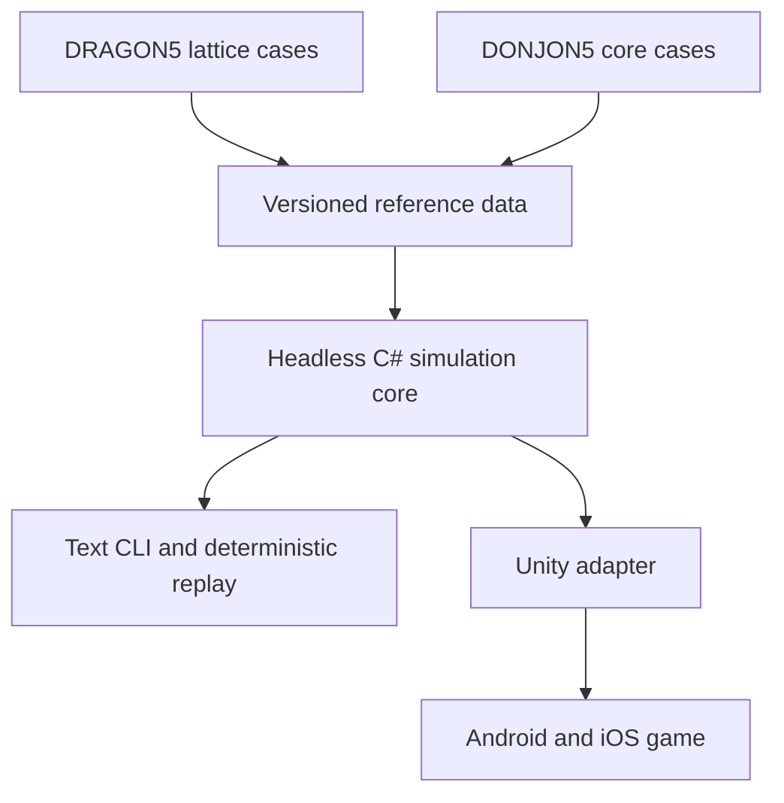

# CANDU Refuelling Game — Codex Implementation Plan

**Document status:** execution baseline 1.1  
**Primary runtime:** engine-neutral C# simulation core, hosted by Unity 6 LTS  
**Reference pipeline:** DRAGON5 and DONJON5, offline only  
**Delivery targets:** Windows/macOS/Linux development builds, Android, and iPhone/iPad  
**AI execution policy:** see [`AGENTS.md`](../AGENTS.md) for the current
Luna/code-review routing, receipt verification, validation, and stop rules.

---

## 1. Mission

Build a playable, deterministic roguelike about online refuelling of a CANDU-style reactor. The player chooses channels and fuelling actions while trying to keep the reactor within an allowed operating envelope for as long as possible. The simulator must respond credibly to fuel movement, depletion, xenon history, the 14 liquid-zone regions, adjusters, and bulk moderator poison. Temperature and moderator-purity feedback are staged additions after the refuelling loop is stable.

The game is not a plant-training simulator and is not intended to reproduce a specific operating unit. DRAGON5 and DONJON5 are offline numerical references used to create and validate reduced data. They are not shipped with the game and are never called at runtime. OpenMC code or generated data is not part of the project.

The strongest implementation path is:

1. Establish reproducible DRAGON5/DONJON5 reference cases.
2. Write an engine-neutral mathematical and data specification.
3. Implement the reduced model directly in headless C#.
4. Compare C# results against immutable reference datasets.
5. Make the text-driven game complete and fun.
6. Profile and optimize the C# core, optionally adding Burst-compatible execution.
7. Add the Unity presentation and mobile delivery layer.

Do **not** extract DRAGON5/DONJON5 source into a unified Fortran program and then translate it. That path would carry far more solver infrastructure and licensing/verification risk than the runtime requires. The porting boundary is the documented mathematics and versioned reference data, not the reference programs' implementation.

---

## 2. Frozen product scope

### 2.1 Required gameplay and simulation

- A CANDU-style core with 380 independently addressable fuel channels and 12 axial bundle positions per channel.
- Alternating channel flow/refuelling direction represented explicitly.
- Configurable fuelling schemes, beginning with 4-bundle and 8-bundle shifts.
- Persistent bundle identity, location, residence time, burnup, and power history.
- Two-group full-core neutronics or an equivalently validated reduced solver.
- Fuel depletion driven by integrated local power and offline-prepared coefficient tables.
- Point-kinetics or quasi-static power amplitude coupled to the spatial solve.
- I-135/Xe-135 history before the first feature-complete release.
- Fourteen liquid-zone regions represented as six physical-zone assemblies where applicable, with individual fill state/effect maps.
- Adjuster devices or banks represented through validated influence maps.
- Bulk moderator poison addition and deliberately slow removal/cleanup.
- Deterministic seeds, save/load, replay, score, loss conditions, and a text-driven playable loop.
- Unity landscape/touch interface and distributable Android/iOS builds.

### 2.2 Deferred until the core loop is proven

- Fuel/coolant/moderator temperature feedback.
- Moderator isotopic-purity feedback.
- Burst/Jobs implementation beyond a profiling-backed need.
- More fuelling schemes or advanced fuel types.
- More sophisticated control optimization or AI operators.

### 2.3 Explicitly out of scope

- Shutdown systems, scram logic, shutdown rods, safety-system simulation, emergency core cooling, containment, or accident progression.
- Operator-training claims, safety analysis, licensing calculations, or representation of a named station's proprietary configuration.
- Full thermal-hydraulics, CFD, detailed pressure-tube mechanics, or full transport at runtime.
- Online invocation or redistribution of DRAGON5/DONJON5 executables.
- OpenMC code, OpenMC-generated production data, or an OpenMC runtime dependency.

If a task would add an out-of-scope feature, Codex must stop and record it in `docs/backlog.md`; it must not implement it opportunistically.

---

## 3. Architecture that must not drift



### 3.1 Runtime boundaries

`ReactorSim.Core` is a plain C# library with no Unity types, lifecycle calls, serialization attributes, or asset references. It owns all numerical state transitions.

`ReactorSim.Cli` is the first playable client. It is also the deterministic test harness and batch runner.

`ReactorGame.Unity` is a thin presentation adapter. Unity input creates commands; the core returns snapshots/events; the UI renders them. Frame rate must not affect simulation results.

The offline physics-data toolchain converts DRAGON5/DONJON5 outputs into a compact, documented, versioned runtime data pack. Runtime code must reject incompatible schema versions and failed checksums.

### 3.2 Target repository layout

```text
/
├── AGENTS.md
├── CODEX_TASK_TEMPLATE.md
├── Directory.Build.props
├── docs/
│   ├── Implementation_plan.md
│   ├── PROJECT_SCOPE.md
│   ├── backlog.md
│   ├── adr/
│   ├── gates/
│   ├── tasks/
│   └── spec/
├── src/
│   ├── ReactorSim.Core/
│   └── ReactorSim.Cli/
├── tests/
│   ├── ReactorSim.Core.Tests/
│   ├── ReactorSim.Golden.Tests/
│   └── fixtures/
├── reference/
│   ├── dragon5/
│   ├── donjon5/
│   └── manifests/
├── tools/
│   └── PhysicsData/
├── data/
│   ├── schema/
│   ├── packs/
│   └── golden/
├── benchmarks/
└── unity/
    └── ReactorGame/
```

Generated reference outputs should not be committed blindly. Commit only inputs, compact approved outputs, manifests, licenses/notices, hashes, and regeneration instructions. Large raw artifacts belong in a versioned artifact store if one is later selected.

### 3.3 Numerical rules

- Use `double` in the authoritative simulation until mobile profiling proves a need for selective lower precision.
- Use explicit SI units internally where practical. Every stored field and serialized value must document its unit.
- Use stable, explicit channel/bundle indexing and never infer direction from array order.
- Use preallocated flat arrays in hot loops; do not begin with object-per-node designs.
- Make every step deterministic for a data-pack version, configuration, command stream, and RNG seed.
- Keep simulation time discrete and explicit. Never use Unity frame delta as physics time.
- Record convergence status, residual/error measures, iteration counts, clamps, and invalid-state diagnostics.
- Fail closed on NaN, infinity, negative concentrations, invalid coefficients, unrecognized data versions, or nonconvergence. Do not silently continue.

---

## 4. Execution governance

[`AGENTS.md`](../AGENTS.md) is the sole operational protocol: it defines the
Luna and code-review lanes, review-receipt acceptance, worker timeboxing,
token/cost accounting, validation levels, escalation, gate overlap, and stop
conditions. This plan intentionally does not restate those rules.

The current execution defaults are GPT-5.6 Luna/high for bounded work and
`code review (high)` for the named architecture, physics, gate, and
risk-triggered review work. Historical Sol-labelled evidence remains historical;
new work follows `AGENTS.md`.

Gates are evidence checkpoints, not automatic serial blockers. The current G2
disposition is exactly `FORCED CLOSED / WAIVED`; it is an administrative
overlap authorization, never a technical PASS, and cannot authorize a new
physics, tolerance, golden-data, or public-contract decision. The current
details and handoffs are maintained in
[`docs/PROJECT_SCOPE.md`](PROJECT_SCOPE.md).

---

## 5. Validation and evidence

[`AGENTS.md`](../AGENTS.md) defines T0-T6, the per-task minimum, automatic
escalation, and reporting requirements. Each phase and gate below supplies its
additional evidence; a task must not infer a full-suite obligation merely from
this plan.

Approved golden data is immutable evidence. T3 consumes already-approved
compact data; it does not rerun DRAGON5/DONJON5. T6 is reserved for reference
baseline reproduction or regeneration. A published number or the P1-T08
literature digest is context or candidate-case evidence until a separately
authorized task proves its exact model, data, geometry, units, normalization,
and reproducibility and receives its required review/gate disposition.

---

## 6. Bounded task contract

Use [`CODEX_TASK_TEMPLATE.md`](../CODEX_TASK_TEMPLATE.md) to define a task,
[`docs/tasks/TASK_REPORT_TEMPLATE.md`](tasks/TASK_REPORT_TEMPLATE.md) to
record it, and [`docs/gates/GATE_REPORT_TEMPLATE.md`](gates/GATE_REPORT_TEMPLATE.md)
for a gate. The required operating behavior and evidence fields live in
`AGENTS.md`; templates are intentionally structure-only.

Each request has one task ID, one bounded outcome, approved inputs, explicit
non-goals, a focused validation plan, and a report. Stop rather than improvising
when inputs conflict or an approved decision is missing.

---

## 7. Development phases and gates

## Phase 0 — Repository, rules, and reproducible toolchain

**Goal:** produce a repository in which a trivial headless C# simulation, tests, and the Unity shell can be built reproducibly.

### Work packages

1. Create the target repository layout.
2. Create `AGENTS.md`, `CODEX_TASK_TEMPLATE.md`, task-report template, decision-record template, and gate-report template.
3. Pin the .NET SDK, Unity 6 LTS editor version, Unity CLI package/version, test framework, serialization library, and formatting rules.
4. Create `ReactorSim.Core`, `ReactorSim.Cli`, and test projects with dependency direction enforced.
5. Create a minimal Unity project that references the core without copying its source.
6. Add scripts for focused build/test selection; add full-suite scripts separately so task agents do not accidentally invoke them.
7. Record platform prerequisites for Android and iOS. iOS final builds require macOS/Xcode and physical-device signing/testing.
8. Pin Unity CLI as an experimental automation surface. Keep batch-mode/editor scripts as a fallback until CLI behavior is proven.

### Exit evidence

- A clean checkout builds the headless solution.
- One trivial focused unit test runs.
- The Unity editor imports the core and opens the empty bootstrap scene.
- Tool versions are machine-readable and documented.
- No simulation or UI feature code exists yet.

### Gate G0 — Code review (high) architecture/toolchain review

Run T3 baseline and the minimal T4 smoke. Review dependency direction, version pins, mobile feasibility, and whether task/testing policies are executable. Gate result is `PASS`, `CONDITIONAL PASS` with named actions, or `FAIL`.

---

## Phase 1 — DRAGON5/DONJON5 reference pipeline

**Goal:** create reproducible offline reference cases and a trustworthy export path before writing production solver logic.

### Work packages

1. Pin exact DRAGON5/DONJON5 source releases/commits and document their licenses and redistribution constraints.
2. Provide repeatable Linux build/run instructions or a container recipe. Do not conceal proprietary nuclear data requirements; use only lawfully available libraries.
3. Establish one minimal DRAGON5 lattice/depletion smoke case.
4. Establish one minimal DONJON5 static-core smoke case using prepared group constants.
5. Define raw-output retention and compact export formats.
6. Implement parsers/exporters as separate tools with parser-only fixtures.
7. Produce reference manifests and checksums.
8. Archive logs, convergence diagnostics, units, normalization, geometry mapping, and case provenance.

### Exit evidence

- Both smoke cases rerun reproducibly in the chosen reference environment.
- Parsers yield identical compact output on repeated runs.
- A second independent check confirms units, indices, and normalization.
- No C# solver has been tuned against undocumented output.

### Gate G1 — Code review (high) reference-provenance review

Run T6 for only the two smoke cases, then parser T2. Inspect input decks, program versions, manifests, hashes, unit conversions, and licensing notes.

### Post-G1 task P1-T08 — Curated CANDU literature digest and physics crosswalk

P1-T08 is a late, user-authorized reference-methodology amendment. It does not
change the approved G1 executable baseline. It must complete before G2-C04,
G2-C06, or any other new physics-related task proceeds.

**Model/review:** code review (high), followed by an independent read-only
code review whose actual model and effort are verified from telemetry.

**Objective:** retrieve from primary publisher/institutional sources, verify,
read, and digest the six candidate references below into a versioned,
claim-level evidence index for physics design and DRAGON5/DONJON5 golden-case
methodology.

The bibliography below is user-supplied candidate metadata, not yet verified:

1. Naceur, A., & Marleau, G. (2019), *CANDU-6 operation simulations using
   accident tolerant cladding candidates* —
   <https://publications.polymtl.ca/5048/11/2019_Naceur_Candu-6_operation_simulations_using_accident.pdf>.
2. Mahjoub, M. (2011), *Application de la théorie des perturbations généralisées
   et des algorithmes stochastiques afin d'améliorer les réflecteurs des
   réacteurs CANDU6* — <https://publications.polymtl.ca/714/>.
3. Le Tennier, U. (2021), *Couplage thermohydraulique-neutronique
   (CATHENA3-DONJON5) pour l'analyse de sûreté du SCWR Canadien* —
   <https://publications.polymtl.ca/6643/>.
4. Holmes, B. (year and complete bibliographic metadata to verify), *Automated
   Refueling Simulations of a CANDU for the Exploitation of Thorium Fuels* —
   <https://publications.polymtl.ca/1307/>.
5. Naceur, A., & Marleau, G. (2017), *Neutronic analysis for accident tolerant
   cladding candidates in CANDU-6 reactors* —
   <https://doi.org/10.1016/j.anucene.2017.11.016>.
6. St-Aubin, E., & Marleau, G. (2018), *CANDU-6 reactivity devices optimization
   for advanced cycles – Part II: Liquid zone controllers adjustment* —
   <https://doi.org/10.1016/j.nucengdes.2018.06.026>.

**Allowed execution files:**

- `docs/reference/candu-literature-digest-v1.md`;
- `reference/manifests/candu-literature-sources-v1.json`;
- `docs/spec/observables-validation-methodology-v1.md`, limited to the
  literature coverage/case-admission methodology and source crosswalk; and
- `docs/tasks/P1-T08.md`.

Source PDFs and publisher artifacts remain external unless the task establishes
explicit redistribution permission. The manifest records path-free identity,
official URL/DOI/repository ID, access status, license/redistribution status,
retrieval date, and SHA-256 when a lawful local artifact is available.

**Required digest content and invariants:**

1. Resolve exact bibliographic metadata and artifact identity from official
   institutional or publisher pages; distinguish inaccessible, abstract-only,
   and full-text evidence.
2. Assign stable digest row IDs to every extracted claim used by the project.
   Each row records page/section/table/figure locator, paraphrased claim,
   evidence class, and applicability limits.
3. Extract, where reported, reactor/fuel/cladding/cycle definition,
   DRAGON5/DONJON5 and coupling-tool versions, nuclear-data library,
   geometry/homogenization, depletion/refuelling history, RRS/device model,
   thermal-hydraulic assumptions, observables, units, normalization,
   convergence, and uncertainty/limitations. Record `NotReported` rather than
   infer a missing value.
4. Crosswalk digest rows to topology, two-group neutronics, burnup/refuelling,
   kinetics/I-Xe, liquid zones, adjusters, poison/feedback, and
   golden-case-generation methodology. Out-of-scope safety/full-thermal-
   hydraulic content is context only and does not expand runtime scope.
5. Classify each proposed use as `ContextOnly`, `MethodologySupport`,
   `CandidateCaseDesign`, or `CandidateNumericEvidence`. No row is
   `ApprovedGolden` in P1-T08.
6. For every candidate numeric use, provide a case-admission gap list covering
   exact tool/version, nuclear data, geometry, state/history, units,
   normalization, output definition, reproducibility, and licensing. Any
   unresolved gap blocks golden use.
7. Record cross-source agreements, conflicts, model differences, and open
   questions without resolving them by unsupported judgment.
8. Update the validation methodology to require digest row IDs and the complete
   case-admission proof in any later task that generates or changes DRAGON5/
   DONJON5 golden cases.

**Explicit non-goals:** selecting/changing equations, constants, units,
tolerances, runtime schemas, reference inputs, generated outputs, or golden
values; implementing CATHENA/full thermal hydraulics, safety analysis, thorium
fuel support, accident-tolerant cladding, or advanced cycles; and downloading or
committing artifacts without established access and redistribution authority.

**Focused validation:** verify all six source identities/links against primary
pages; validate the manifest deterministically; assert every digest claim has a
source locator and use class; assert every physics domain has applicable row IDs
or an explicit coverage gap; assert no `ApprovedGolden` row or undocumented
number exists; run the repository format/link checks. The reference-methodology
trigger requires T3 and independent code review (high). T6 runs only if a later,
separate task changes or regenerates a reference baseline.

**Definition of done:** all six sources have truthful access/provenance status,
the digest and crosswalk are complete and internally cited, golden-case
admission remains fail-closed, the methodology references the digest, exact
checks/results are reported in `docs/tasks/P1-T08.md`, and the final independent
code-review (high) disposition is PASS with no unresolved High/Medium finding.

---

## Phase 2 — Runtime mathematical specification

**Goal:** freeze the minimum model the C# implementation must reproduce.

This phase is code-review-led. Luna may format documents or implement already-approved schemas but must not choose the equations.

### Required specifications

1. Core topology: channel coordinates, 12 axial positions, neighbour stencil/leakage coupling, boundary conditions, and alternating flow direction.
2. State vectors: flux/power fields, bundle inventory, burnup, nuclide history, RRS states, controller state, time, and diagnostics.
3. Two-group steady spatial equations and coefficient meanings.
4. Eigenvalue/power normalization and source iteration/convergence rules.
5. Spatial-to-kinetic coupling and update cadence.
6. Refuelling as an atomic state transition, including bundle identity movement and boundary insertion/discharge.
7. Burnup integration and interpolation of lattice-derived coefficients.
8. I-135/Xe-135 equations, yields/decay/absorption conventions, and initial conditions.
9. Liquid-zone, adjuster, and bulk-poison influence-map representation.
10. Temperature and purity branch schema, even if feedback is initially disabled.
11. Invalid-state handling, clamping policy, failure modes, and diagnostic requirements.
12. A complete unit table and sign-convention table.
13. Validation observables and quantity-specific provisional tolerance profiles,
    including quantity/unit/scope/norm identity, comparison rule, threshold
    state, approval status, and owner gate. Phase 2 must define the profile
    contract and explicit deferred semantics; it must not invent numeric
    threshold values. Evidence-backed numeric acceptance thresholds are
    supplied and approved only at the named owner gate (G4, G5, G6, G7A, or
    G7B), as applicable.

### Exit evidence

- Every runtime state field has a definition and unit.
- Every discrete transition has preconditions/postconditions.
- Reference exports map unambiguously into the runtime schema.
- Quantity-specific tolerance profile identity, ownership, and deferred/
  provisional/approved status are explicit; numeric thresholds may remain
  deferred until the named owner gate supplies evidence and approves them.
- Open questions are either resolved or explicitly deferred without blocking the MVP.

### Gate G2 — Code review (high) mathematical design approval

The existing Phase 2 specifications are the implementation baseline. G2 is
currently `FORCED CLOSED / WAIVED` by user direction, so Phase 3 and later work
may proceed using those frozen specifications. This is not a technical PASS:
tasks must stop on a critical blocker and must not invent equations, units,
signs, convergence rules, tolerances, golden data, or public contracts. The gate
report must identify assumptions made for gameplay simplification and distinguish
them from reference-code behavior.

---

## Phase 3 — Headless domain core and data contracts

**Goal:** implement deterministic state storage, configuration, data loading, commands, snapshots, and serialization without physics complexity.

### Work packages

1. Strongly typed channel/bundle indices and explicit flow direction.
2. Flat bundle inventory with stable bundle IDs.
3. Immutable simulation configuration and versioned data-pack descriptor.
4. State snapshot/event/diagnostic contracts.
5. Command queue and explicit simulation clock.
6. Seeded RNG abstraction, used only where a specification permits randomness.
7. Versioned save/load and command-log replay.
8. Data-pack validation: schema, dimensions, finite ranges, units, hashes, and compatibility.
9. Synthetic small-core fixtures that are easy to inspect by hand.

### Gate G3 — Code review (high) state-contract review

Run T3. Confirm replay determinism, round-trip serialization, index boundaries, atomic command application, invalid-data rejection, and absence of Unity dependencies.

---

## Phase 4 — Static two-group spatial solver MVP

**Goal:** calculate stable flux/power shape and effective multiplication for a fixed state quickly enough for interactive iteration.

### Work packages

1. Implement topology/stencil assembly from the approved specification.
2. Implement matrix-free or compact coefficient application using preallocated arrays.
3. Implement the approved eigenvalue/source iteration and normalization.
4. Emit residual, iteration count, convergence reason, and invalid numeric diagnostics.
5. Test on one-node, symmetric, homogeneous, leakage-free, and intentionally nonconvergent synthetic cases.
6. Compare against the minimal DONJON5 static case.
7. Expand to a small set of representative reference snapshots: fresh/equilibrium-like, refuelled perturbation, RRS perturbation, and poison perturbation.
8. Benchmark without optimizing prematurely.

### Gate G4 — Code review (high) solver validation

Run T3 with all approved golden comparisons. T6 is not required unless reference cases changed. Review field errors, integrated regional powers, multiplication/eigenvalue metric, convergence robustness, conservation/normalization, and runtime allocations. Tolerances become approved only here.

---

## Phase 5 — Refuelling and depletion

**Goal:** make refuelling materially alter the core and persist through burnup history.

### Work packages

1. Implement 4-bundle and 8-bundle schemes from a declarative scheme definition.
2. Apply shifts atomically in the correct direction, preserving bundle IDs/history.
3. Insert fresh bundles, discharge boundary bundles, and generate auditable events.
4. Integrate local bundle power over explicit time steps into burnup.
5. Interpolate approved coefficient tables with documented out-of-range behavior.
6. Recompute affected coefficients and spatial state at the specified cadence.
7. Add invariants: exact bundle count, no duplicate IDs, monotonic nonnegative burnup, legal locations, and energy-accounting checks.
8. Add deterministic multistep refuelling histories and compare selected histories to DONJON5 reference sequences.

### Gate G5 — Code review (high) refuelling/depletion review

Run T3 and the relevant golden histories. Inspect bundle-by-bundle movements, power-to-burnup units, interpolation edges, accumulated drift, repeated refuelling, discharge behavior, and long deterministic runs.

---

## Phase 6 — Limited reactor regulating system

**Goal:** model only the controls needed for refuelling gameplay and spatial stability.

### Work packages

1. Represent 14 independently tracked liquid-zone compartments and their physical assembly grouping.
2. Apply validated, state-dependent zone influence maps.
3. Represent the approved adjuster set/banks and motion constraints.
4. Implement bulk moderator poison addition and slow withdrawal/cleanup as separate rate-limited actions.
5. Implement a simple, documented regulating controller for total power and tilt, with manual game commands where desired.
6. Model actuator limits, rates, delays, saturation, and diagnostics.
7. Add scenarios for centered perturbation, regional tilt, zone saturation, adjuster insertion/withdrawal, and poison recovery.

Do not add shutdown or scram behavior. If the state leaves the playable envelope, the game records a loss; it does not simulate safety-system response.

### Gate G6 — Code review (high) RRS review

Run T3 and approved RRS golden comparisons. Verify device sign, region mapping, saturation, controller stability, timestep sensitivity, and interactions with refuelling.

---

## Phase 7 — Time history: kinetics, xenon, then optional feedback

**Goal:** make yesterday's fuelling and power history matter to today's core.

### Phase 7A work packages

1. Add the approved point-kinetics/quasi-static amplitude update.
2. Add I-135 and Xe-135 production, decay, neutron absorption, and spatial/coarse-region mapping.
3. Define stable integration methods and timestep limits.
4. Add startup-from-equilibrium, power change, shutdown-like power reduction without safety-system modeling, and xenon-oscillation test scenarios.
5. Couple xenon coefficients to the spatial solve at a controlled cadence.

### Gate G7A — Code review (high) kinetics/xenon review

Run T3, long histories, timestep-convergence comparisons, nonnegative-concentration checks, and relevant golden cases.

### Phase 7B optional work packages

1. Add a small number of lumped fuel/coolant/moderator temperature states.
2. Add coefficient branches/interpolation for the approved feedback variables.
3. Add moderator-purity state and slow drift/control if the reference data supports it.
4. Profile and validate coupled stability before enabling these by default.

### Gate G7B — Code review (high) feedback review

Required only when feedback is enabled. Run T3 and feedback-specific golden/timestep/edge tests. A failed G7B does not block a release with the feature disabled.

---

## Phase 8 — Complete text-driven game

**Goal:** prove the full game loop without Unity presentation risk.

### Work packages

1. CLI commands: new run, inspect core/channel/bundle, advance time, refuel, set RRS actions, pause, save, load, replay, and quit.
2. Seeded scenarios and difficulty profiles with explicit parameter files.
3. Operating envelope and loss conditions for excessive/insufficient reactivity, power, tilt, device exhaustion, or other approved gameplay limits.
4. Scoring based on survival, energy production, fuelling efficiency, stability, and avoidable control use.
5. Turn/event summaries that explain cause and effect without exposing raw solver complexity.
6. Deterministic replay file with version/data-pack checks.
7. Scripted baseline policies/bots for balance regression, not as player-facing automation.
8. Long-run soak cases and invariant monitoring.

### Gate G8 — Code review (high) vertical-slice review

Run T3, long soaks, replay checks, seed reproducibility, malformed-command tests, and several scripted strategies. Review whether choices are understandable, consequential, and recoverable before investing in UI polish.

---

## Phase 9 — Performance, Burst decision, and mobile spike

**Goal:** meet interactive and thermal budgets on representative mobile hardware without changing results.

### Work packages

1. Establish versioned benchmark scenarios and record desktop plus representative Android baseline.
2. Profile allocation, solver hotspots, data movement, and solve latency.
3. Optimize plain C# layout/loops first.
4. Create a narrow Burst-compatible backend only if profiling shows a justified benefit.
5. Compare scalar and optimized backends against identical command streams and golden data.
6. Move long solves off the Unity frame loop while preserving deterministic command ordering.
7. Build an Android device spike and an iOS/Xcode physical-device spike.
8. Run sustained sessions to observe memory growth, frame hitches, battery/thermal throttling, suspension/resume, and autosave integrity.

### Gate G9 — Code review (high) performance/mobile review

Run T3, T4, and T5. Require numerical equivalence within approved per-quantity tolerances, no replay drift, no sustained allocations in hot loops, no UI-frame blocking, and documented device results. Any precision or backend change automatically triggers this gate.

---

## Phase 10 — Unity game interface

**Goal:** turn the validated text game into a legible, touch-first mobile game.

### Work packages

1. Landscape, safe-area-aware shell and navigation.
2. Zoomable/filterable core map with channel state, power, burnup, fuelling age, and alarm overlays.
3. Channel/bundle detail panel and refuelling preview.
4. Explicit confirm/cancel flow for irreversible fuelling commands.
5. RRS panel for zones, adjusters, and poison with rates/limits visible.
6. Time controls, trend plots, event log, score, and failure explanation.
7. Save/load/replay browser and autosave lifecycle integration.
8. Accessibility: color-safe palettes, non-color encodings, scalable text, adequate touch targets, and reduced-motion option.
9. Tutorial scenarios that teach refuelling consequences progressively.
10. Unity CLI automation where stable; retain documented editor/batch fallback.

Pure visual tasks run T1/T4 scene checks, not T3. Any change to core adapters, commands, snapshots, serialization, clocks, or data loading triggers T3.

### Gate G10 — Code review (high) UX/integration review

Run T3, T4, and platform smoke portions of T5. Review state correctness across pause/resume, duplicate-touch prevention, command confirmation, accessibility, safe areas, and error messaging.

---

## Phase 11 — Hardening and release candidate

**Goal:** produce distributable builds with traceable numerical evidence and clear limitations.

### Work packages

1. Lock runtime data pack and save schema; implement any required migrations.
2. Complete notices/licenses and document the distinction between reference tools and shipped code/data.
3. Crash/error telemetry policy, privacy disclosures, and offline behavior.
4. Store assets, signing, package identifiers, versioning, and release notes.
5. Representative device matrix, sustained performance runs, suspend/resume, low-storage, corrupted-save, and clean-install/upgrade checks.
6. Player-facing disclaimer: entertainment simulation, not operator training or safety analysis.
7. Archive gate reports, benchmark results, validation manifests, and known limitations.

### Gate G11 — Code review (high) release audit

Run T3–T5 in full. Run T6 only if reference data changed since its last approved manifest. Audit requirements traceability, open defects, data provenance, deterministic replay, platform results, licensing, and store readiness. Release only on `PASS`; a conditional result creates a new candidate after the named actions are completed.

---

## 8. Execution register

The initial Phase 0-2 queue and one-off agent prompts are historical planning
material, not current instructions. Their outcomes belong in
`docs/tasks/` and `docs/gates/`; current completion, evidence gaps, and the
next handoff belong in [`docs/PROJECT_SCOPE.md`](PROJECT_SCOPE.md).

Create later work as one-purpose tasks from the relevant phase below, using the
task template and the current scope lookup. A phase description or this plan
does not itself authorize a task, alter a frozen decision, or create a numeric
acceptance threshold.

---

## 9. Definition of done by capability

### Numerical capability

- Equations, units, indexing, and normalization are documented.
- Synthetic/analytic properties pass.
- Approved reference observables pass quantity-specific tolerances.
- Nonconvergence and invalid states are reported, never hidden.
- Results are deterministic under repeat execution.

### Gameplay capability

- The behavior is usable from the CLI before Unity work begins.
- It changes a meaningful player decision and has an understandable consequence.
- Save/load and replay preserve it.
- At least one scripted scenario exercises success, failure, and boundary behavior.

### Unity capability

- It does not duplicate simulation logic.
- It remains responsive while the core solves.
- Touch, safe area, suspend/resume, and error states are tested.
- Android and iOS device evidence exists where platform behavior matters.

### Documentation capability

- Public APIs and data schemas are documented.
- Assumptions and deliberate simplifications are visible.
- Commands to reproduce focused checks are included.
- Any reference data has provenance and hashes.
- Maintain `docs/physics/candu-nuclear-diffusion-student-guide.md` as the
  student-facing, derived explanation of implemented and planned physics.
- Regenerate its PDF with `tools/build_physics_guide_pdf.py` and run
  `tools/Check-PhysicsGuideConsistency.ps1` whenever an approved physics
  specification, runtime model, gate disposition, or game-loop contract
  changes.
- Keep the private site's bundled guide PDF byte-identical to the generated
  output; its README documents that derived distribution step. Hosting or
  publication remains separately authorized.

---

## 10. Task and gate requests

Do not copy prompts from this plan. Use
[`CODEX_TASK_TEMPLATE.md`](../CODEX_TASK_TEMPLATE.md) for a bounded task,
[`docs/tasks/TASK_REPORT_TEMPLATE.md`](tasks/TASK_REPORT_TEMPLATE.md) for
the report, and [`docs/gates/GATE_REPORT_TEMPLATE.md`](gates/GATE_REPORT_TEMPLATE.md)
for a gate. The templates reference `AGENTS.md`, which is maintained as the
single operational source.

Historical task-specific prompts, including the former P3-T03 continuation
prompt, are retired from active use. Their completed outcome and review
evidence remain in the corresponding task and gate reports.

---

## 11. Decision log seed

Create these ADRs during Phase 0/2 so future agents do not reopen settled questions accidentally:

- ADR-001: Unity 6 LTS as client and mobile delivery platform.
- ADR-002: Headless engine-neutral C# core; Unity is presentation only.
- ADR-003: DRAGON5/DONJON5 offline oracle; no runtime or source-code port.
- ADR-004: OpenMC excluded from code and generated production data.
- ADR-005: Deterministic fixed-step command-driven simulation.
- ADR-006: Double-precision authoritative backend; optimize only after profiling.
- ADR-007: Immutable, manifested golden reference data.
- ADR-008: Limited RRS scope; no shutdown/scram simulation.
- ADR-009: Luna implementation / code review (high) gate-review policy.
- ADR-010: Proportionate testing and risk-triggered full suites.

---

## 12. Stop conditions

The stop conditions in [`AGENTS.md`](../AGENTS.md) are authoritative. This
plan adds no exception for a missing equation, irreproducible reference result,
unresolved license or nuclear-data source, changed tolerance/golden value,
nondeterminism, out-of-scope safety behavior, unapproved native dependency,
secret/signing material, or publication.
