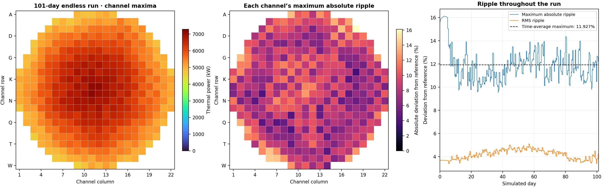
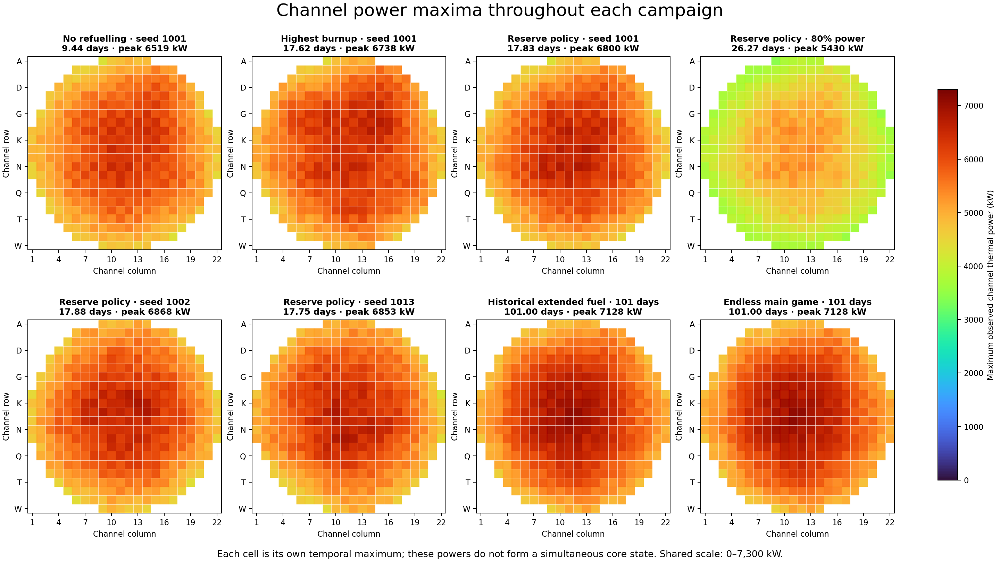

# Maximum channel powers and ripple over gameplay

The normal endless Free practice game survived **101 days** at full power,
using **189 orders / 1,512 bundles**, and remained running at the observation
cutoff. No horizon override, debug fuel grant or physics override was used.
The main game has no duration or fresh-fuel budget; operating limits can still
end a run. The existing one-day challenge retains its own finite configuration.

The time-average maximum absolute channel ripple was **11.9267%**. Average RMS
ripple was **4.2007%**, and the highest observed channel power was
**7,127.84 kW**, below the 7,300 kW limit. Channel **200 / M11** reached that
power at day **100.1458**. Peak bundle power was **729.35 kW**; average LZC
stayed between **29.14% and 50%** and global tilt within **±1.30%**.



Download the [SVG](figures/endless-channel-power-ripple-v1.svg),
[all eight campaign maps](figures/maximum-channel-power-maps-v1.png),
[all-map SVG](figures/maximum-channel-power-maps-v1.svg),
[channel CSV](../../benchmarks/channel-power-maps-v1.csv) or
[measurement JSON](../../benchmarks/channel-power-maps-v1.json).
The [endless campaign record](../../benchmarks/endless-run-playtest-v1.json)
includes every fuel order, daily observations and paired-speed differences.

## What was measured

For channel `c`, let `r[c,t] = P[c,t] / referencePower[c]`. The reference is
Game's fixed full-power, time-average, no-adjuster channel target. The UI's
ripple ratio is **100% at the target**. In this report, absolute ripple means
`100 × abs(r - 1)`, so **0% means no deviation**.

The requested average maximum ripple is calculated as:

`sum(intervalSeconds × maxChannel(abs(r - 1))) / totalSeconds × 100`.

This is a simulation-time average of the worst channel at each instant. It is
different from taking each channel's worst value across the entire run and
then averaging those 380 values; that second measure is **8.6369%** for the
101-day run. The time-average maximum positive departure above reference is
**10.2564%** (equivalently, average highest ripple ratio **110.2564%**).
The largest absolute departure seen at any individual observation was
**16.1158%**.

Each map cell stores that channel's highest observed thermal power throughout
the campaign. Different cells can peak on different days, so the map is not a
simultaneous reactor state and its cell values must not be summed as core
power. Empty cells are outside the authored 380-channel geometry. Columns
are 1–22; rows follow the game's A–W ordering, omitting I.

The harness records authoritative snapshots at every half-hour spatial solve
and immediately after each accepted fuel move. Powers are held between these
boundaries at the fixed target used in these campaigns, so the maps capture
the accepted state maxima and the interval-weighted average follows the
game's spatial cadence. Instantaneous moves add no averaging duration.
At 80% power, the initial queued target is applied for analysis; the
zero-duration full-power initialization is excluded from that campaign's
map. The reference itself stays at full power, explaining the larger absolute
departure in the lower-output run.

## Campaign comparison

The first seven campaigns preserve the historical bounded configurations from
the [earlier survival study](long-run-playtest.md); their fuel limits do not
describe the current main game.

| Campaign | Days observed | Peak channel kW | Average maximum absolute ripple |
| --- | ---: | ---: | ---: |
| No refuelling, seed 1001 | 9.4375 | 6,518.77 | 15.8961% |
| Highest burnup policy, seed 1001 | 17.6250 | 6,738.23 | 14.0554% |
| Reserve policy, seed 1001 | 17.8333 | 6,800.45 | 12.6886% |
| Reserve policy, 80% power | 26.2708 | 5,429.50 | 27.1424% |
| Reserve policy, seed 1002 | 17.8750 | 6,867.62 | 9.4134% |
| Reserve policy, seed 1013 | 17.7500 | 6,853.14 | 10.3540% |
| Historical 2,048-bundle experiment | 101.0000 | 7,127.84 | 11.9267% |
| **Endless main game** | **101.0000, still running** | **7,127.84** | **11.9267%** |



The endless and historical extended-fuel runs produced identical power maps
and ripple averages. The normal endless run continued at day 101 while the
bounded experiment reported horizon completion. This demonstrates that the
new configuration changes duration and inventory accounting without changing
the measured physics or refuelling strategy.

## Speed and numerical verification

The endless native run compared **1× and 10×** at all **4,848 half-hour steps**
and all **189 accepted moves**, using identical simulation-time orders. Time,
fuel identities, operating outcomes and consumption agreed. Maximum channel
power difference was **1.397 × 10⁻⁸ W**, score difference
**5.548 × 10⁻¹¹ points**, and zone fill difference **1.769 × 10⁻¹³**.
These are numerical roundoff differences, not a meaningful speed-dependent
gameplay change. This comparison holds input timing fixed in simulated time;
reaction time under live human play naturally changes with speed.

The production **AOT WASM browser** also replayed all 189 orders to day 101 at
both speeds and remained running. Its 281 daily/order-boundary checkpoints
compared all channel powers, bundle powers/burnups, zone fills, energy, score,
inventory and outcomes. There were no lifecycle mismatches or browser errors;
maximum channel difference was **1.304 × 10⁻⁸ W** and score difference
**5.275 × 10⁻¹¹ points**. Both final states used 1,512 bundles with unlimited
fuel enabled and matched the native final measurements. See the
[browser record](../../benchmarks/endless-browser-playtest-v1.json).

Validation passed **113 Core + 72 Game + 37 Browser + 131 frontend tests**,
the production frontend build, the full Pages UI smoke path (including the
bounded challenge and returning to endless practice), and the
[six-case Pages reproduction matrix](../../benchmarks/endless-pages-reproduction-v1.json)
with matching repeated digests and zero browser errors. The tested AOT runtime
is staged in the normal local browser assets. The published Pages site requires
the usual source deployment to receive this working-tree change.

The Python plotting tool independently integrates the saved timeline to
verify all four time-weighted measures, checks all 380 channel coordinates and
map peaks, and reproduces the authoritative Game score integral. Final energy
was **5,003,136 MWh thermal / 1,575,600 MWh electric estimate** and score
**2,059.2605 points**. The measurement cutoff proves survival beyond 100 days;
it does not prove this heuristic survives forever.

## Reproduction

```powershell
dotnet run --project tools/LongRunPlaytest -c Release -- --endless=true --pair=true --days=101 --output=tmp/longrun-maps/endless
python tools/Plot-LongRunPower.py tmp/longrun-maps
```

The plotting command expects all eight campaign reports in that directory.
Historical runs use the same tool with `--endless=false`, policies `none`,
`oldest` or `reserve`, seeds 1001/1002/1013, `--power=0.8` for the lower-output
case, and `--fuel=2048` for the historical extended-stock comparison. Output
stems match the campaign IDs in the measurement JSON. Matplotlib and NumPy
are offline reporting dependencies only.

The historical two-speed browser replay script has been retired; its source remains
in Git history. Current web checks use `npm run smoke`, `npm run smoke:scales`
and the deterministic WASM benchmark. Current daily campaigns are documented in
[the v8 acceptance archive](../../benchmarks/axial-marshak-v8-2026-10-10/README.md).

Measured on 2026-10-04 using the authored cycle190 power-limit pack. Native
telemetry remains in generated `tmp/longrun-maps/*.jsonl` files; standalone
maps and per-channel measurements are saved above.
