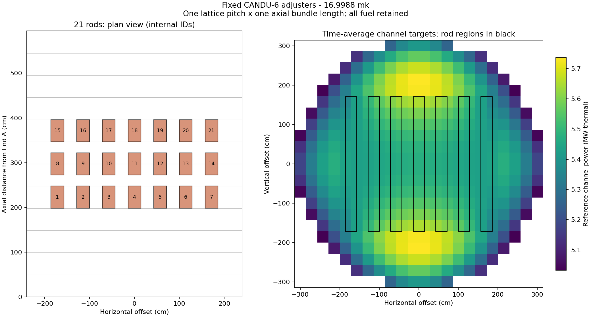

# Fixed CANDU-6 adjusters and channel reference

The active `candu6-two-group-diffusion-v1-adjusters-v5` pack adds 21 fully inserted
vertical adjusters to the authoritative Core eigenproblem. The rods remain fixed
in normal play; there are no withdrawal, shim, shutdown or accident controls.
Fuel inventory, the 380 channels, twelve bundle slots, refuelling direction and
thermal power normalization remain intact.

## Position and discretization

[IAEA-TECDOC-1994, printed page 20 and Table 10](https://www-pub.iaea.org/MTCD/Publications/PDF/TE-1994web.pdf)
provides the interstitial three-plane, seven-rod layout. Measured from the first
fuel-bundle boundary, axial centres are 222.89, 297.18 and 371.48 cm. Horizontal
centres relative to the core centre are 0, ±57.15, ±114.3 and ±171.45 cm. Vertical
steel spans −171.45 to +171.45 cm, with inner segments between ±85.725 cm and
outer segments beyond. The source is a stylized benchmark with simplified devices.

The implementation uses exact 4.5, 6 and 7.5 bundle lengths for those rounded
axial centres. Each homogenized rod region is one pitch (28.575 cm) wide across
the channels and one bundle length (49.53 cm) deep along them. Its vertical span
covers twelve pitches. This is an absorption increment to the fuel/moderator cell,
not a substitution of a fuel bundle by a rod. Rod IDs are internal traversal IDs
and do not claim plant bank numbering.

Volume overlap maps the interstitial region onto the existing cell-centred mesh.
Each transverse region overlaps two fuel columns equally. The two outer axial
planes occupy bundle indices 4 and 7 (zero based); the central plane shares its
increment equally between indices 5 and 6. Mapping the central rod entirely to
one index would introduce a false axial asymmetry. Every rod conserves twelve
cell volumes of homogenized region. All 21 rods produce 672 cell contributions.

A [2023 TRACE/PARCS study, section 3.3](https://onlinelibrary.wiley.com/doi/10.1155/2023/6163974)
describes device-centred one-pitch by one-pitch by one-bundle homogenization and
the sensitivity to axial mapping. Its reactor is CANDU 900, so it supports the
modeling approach rather than these CANDU-6 coordinates or worth.



## Absorption and worth

`PracticeAdjustersV1` builds the immutable spatial map. The pack declares the
layout identity and inner-segment absorption increments in SI inverse metres:

- Fast: 0.005396804809570312 m^-1.
- Thermal: 0.05396804809570312 m^-1.

The outer segment is weighted by the steel-area ratio from Table 10: solid-shim
area plus steel-tube area. The common fast/thermal ratio of 0.1 and absolute
strength are authored surrogate choices, not imported transport cross sections.
Diffusion, scattering and neutron-production increments are not separately modeled.
The rod increment is added once during base coefficient construction, before
liquid-zone and dynamic-xenon overlays. This covers ordinary, prepared, refuel,
controller-candidate and time-average reference solves through the same seam.
Archived packs without the optional adjuster block retain their original physics.

The selected target is **17 mk**, consistent with the approximate reserve stated
in [CANDU Overview, module 3B, printed page 3B-11](https://canteach.candu.org/Content%20Library/20044211.pdf).
Other designs/model conditions give different worths; this is a calibration target
for the authored game rather than a universal plant value.

Measure on identical seed-1001 aged fuel, no changing xenon inventory, and all
fourteen zones fixed at 50%. Do not allow the controller to cancel the rod removal:

`worth_mk = 1000 * (1/k_all_in - 1/k_all_out)`.

Independent tight solves give:

| Quantity | Value |
| --- | ---: |
| All-in k at half zones | 1.000000222 |
| All-out k at half zones | 1.017293021 |
| Total adjuster worth | 16.998833 mk |
| Empty-to-full zone worth | 6.999989 mk |
| Initial peak channel, seed 1001 | 5.929533 MW |
| Initial peak bundle, seed 1001 | 534.269492 kW |

Adding absorption to an already critical v4 core would exceed the seven-mk zone
range. The offline fit therefore refits only the effective boundary leakage to
0.0007172295891761779 m² fast and half that thermal, and makes a 0.0393% zone-slope
correction. Interior coupling, all fuel coefficient knots, the static k-infinity
curve, masses and energy per fission are preserved. The independent frozen-shape
one-day burnup audit is 0.377759 mk/FPD with the new shape; its zone worth is
7.000024 mk. These quantities are conditional on this inventory and model.

## Reference and reproduction

The immutable reference becomes `cycle190-time-average-21-adjusters-half-zones-v2`.
It uses the existing exact dwell-range averages and half-filled zones with the
same inserted rods as live play. It sums to 2,064 MW thermal, ranging from
5.032316 to 5.736738 MW/channel. There is no clipping or total-power derating.
The rods flatten this surrogate further; they do not imply an increase in peaks.

- [Fit and exact geometry map](../../data/calibration/adjusters-v5/fit/fit.json).
- [Archived pre-adjuster source](../../data/calibration/adjusters-v5/source-pack.json).
- [All 380 targets](../../benchmarks/adjusters-v5-reference/reference.json) and
  [CSV](../../benchmarks/adjusters-v5-reference/reference.csv).
- [Independent burnup/zone audit](../../benchmarks/adjusters-v5-reactivity.json).

```powershell
dotnet run --project tools/AgedCoreBenchmark -c Release -- --fit-adjusters data/calibration/adjusters-v5/source-pack.json tmp/adjusters-v5-refit
# Review proposal and zone slopes before staging another revision.
tools/Sync-PhysicsPacks.ps1 -Stage
dotnet run --project tools/ChannelReferenceBenchmark -c Release -- benchmarks/adjusters-v5-reference
dotnet run --project tools/AgedCoreBenchmark -c Release -- --reactivity-scale benchmarks/adjusters-v5-reactivity.json
python tools/AgedCoreBenchmark/plot-adjusters.py data/calibration/adjusters-v5/fit/fit.json benchmarks/adjusters-v5-reference/reference.json
```

The new pack/reference identity deliberately changes saved-run replay and wire
fixtures. The previous 100-day v4 benchmark remains historical evidence and does
not establish 100-day capability for v5. Browser verification uses the local
Pages-shaped WASM build; no deployment is implied.

## Validation

Core passed 119 tests, Game passed 74 tests, Browser passed 37 tests, and the
frontend passed 149 tests. Normal and Pages production builds passed. The local `/CRS/` smoke passed
with the authoritative Release non-AOT WASM: refuelling, challenge completion,
seed retry/reset, session/history, fresh-fuel poison, recovery and responsive
layouts. The [WASM reproduction](../../benchmarks/adjusters-v5-browser.json)
matched all six matrix rows across two samples, with identical matrix digests and
no console/page errors. [Smoke evidence](../../benchmarks/adjusters-v5-smoke.json)
retains the complete scenario results. The complete result is
recorded in [verification](../../benchmarks/adjusters-v5-verification.json).
The build-info commit denotes the base HEAD; this is working-tree validation,
not a deployment or an AOT performance measurement.
