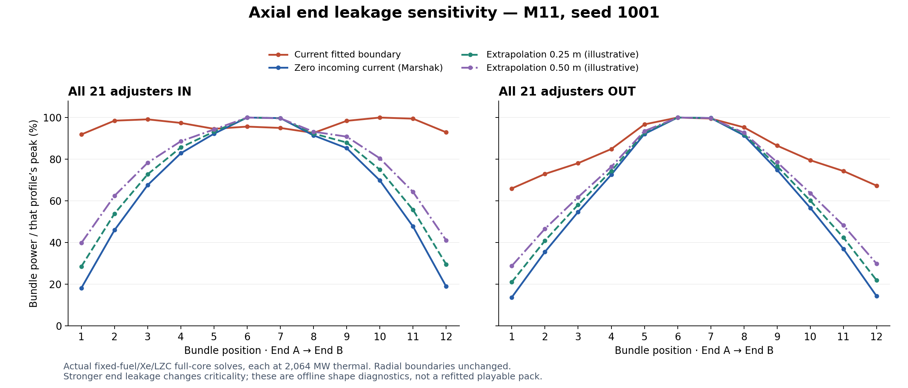

# Axial end falloff review, 10 October 2026

Implemented subsequently as the [default v8 axial Marshak pack](axial-marshak-v8.md).
The diagnosis and isolated sensitivity results below retain their v7 context.

The current seed-1001 M11 profile is too flat at its axial ends for the intended
diffusion-based surrogate. End bundles are 91.89% / 92.93% of the channel peak
with adjusters inserted and 65.97% / 67.32% with all adjusters withdrawn.

## What the fuel-management material establishes

[Rouben's CANDU Fuel Management Course](https://www.nuceng.ca/canteach-rev2/library/20031101.pdf),
section 5.1, printed page 20 (PDF page 25), explicitly describes the four bundles
nearest the inlet as low-power bundles that remain for two cycles in the
eight-bundle-shift scheme. Figure 5.1 is a movement schematic, not a tabulated
axial flux profile. Section 6.2's homogeneous model concerns averaged fuel
irradiation and does not supply a universal end-bundle power ratio.

[CANDU reactor-physics training](https://canteach.candu.org/Content%20Library/20050300.pdf),
lesson 127.10-7, printed lesson page 4 (PDF page 80), plots cosine-type axial flux
and defines the zero-flux extrapolated plane outside the physical core:
`L_extrapolated = L + 2 delta`. This supports an end falloff, not a zero value
for the whole end bundle or a reflection boundary.

[Naceur and Marleau (2019)](https://publications.polymtl.ca/5048/11/2019_Naceur_Candu-6_operation_simulations_using_accident.pdf),
section 3.3, discusses the cosine envelope for a uniformly fuelled core without
devices and device flattening. Figure 12 is a **radial** bundle-power slice at
axial plane 6; it must not be digitized as a twelve-bundle axial target. The
source's operating conditions are not identical to the aged game inventory.

## Current code and dimensional diagnosis

Core already marks front/back faces as vacuum. `BuildBoundaryConductances` in
`FullCoreDiffusionModelContracts.cs` assigns the same fitted scalar conductance
to each non-reflective axial and radial face. The active v7 values are:

- Cell length `h = 0.4953 m`, twelve cells, total `L = 5.9436 m`.
- Axial interior conductance fast/thermal: 0.006594231 / 0.003297115 m².
- Boundary conductance fast/thermal: 0.000787547 / 0.000393773 m².
- Authored effective diffusion coefficients from `C = D A / h`: 0.04 / 0.02 m.

For a node-centred leakage face with zero flux at an exterior extrapolated plane,

`C_boundary,g = D_g A / (h/2 + delta_g)`.

The current ratio corresponds to `delta = 3.899561 m` at each axial end. This is
an equivalent diagnostic distance for the fitted surrogate, not a measured
reflector thickness. Criticality fitting has effectively weakened end leakage.

[Bell and Glasstone, Nuclear Reactor Theory, section 3.1e](https://digital.library.unt.edu/ark:/67531/metadc870144/m2/1/high_res_d/4074688.pdf)
gives the zero incoming partial-current condition `J_n = phi/2`, or the diffusion
Robin form `phi + 2 D d(phi)/dn = 0`. Thus the simplest Marshak case uses
`delta_g = 2 D_g`. Setting **net** current to zero instead is reflection and
would suppress end leakage. Reflector return requires a separately justified
albedo or explicit reflector region.

## Offline sensitivity results

The [audit](../../benchmarks/axial-boundary-2026-10-10/axial-boundary-audit.json)
holds all fuel, Xe, LZC fills (49.946195%), radial leakage and total core power
(2,064 MW thermal) fixed. Only axial end-face loss changes, through an exactly
equivalent additional diagonal `Delta C / V` sink on positions 1/12. This sink is
an offline operator diagnostic, not an added material absorber in the runtime.
Each case converged below 2e-7 residual. No runtime pack was staged.

| Axial case | M11 end/peak, rods in | M11 end/peak, rods out | Keff, rods in |
| --- | --- | --- | --- |
| Current fitted boundary | 91.9–92.9% | 66.0–67.3% | 1.0000043 |
| Zero incoming current, delta fast/thermal 0.08/0.04 m | 18.2–18.9% | 13.7–14.3% | 0.9614430 |
| Illustrative common delta 0.25 m | 28.5–29.6% | 21.1–21.9% | 0.9671253 |
| Illustrative common delta 0.50 m | 39.8–41.1% | 28.8–29.9% | 0.9731325 |

For comparison, an ideal homogeneous twelve-cell cosine with zero flux at the
physical faces has end-bundle averages 13.17% of its middle-bundle average;
the next two positions are 38.60% and 61.40%. With an illustrative 0.10 m
extrapolation distance, these become 17.83%, 42.12% and 63.73%. These values are
analytic diagnostics, not source-measured CANDU-6 operating targets. Absorbers,
fuel history and reflector return change the actual bundle ratios.

## Recommended implementation

Separate axial boundary conductance from radial effective-reflector treatment.
Represent the axial boundary using explicit groupwise extrapolation lengths or
a documented partial-current/albedo condition. Keep the boundary in Core's
loss operator, preserving nonnegative leakage and exact reflecting-face zeros.

Do not stage the isolated stronger-leakage proposal directly: the fixed-state
Keff values show that it breaks the existing startup criticality calibration.
Recalibrate criticality, adjuster worth and LZC worth together, with the axial
shape constraint visible in the fitting objective. Then regenerate the channel
reference and pack provenance, remeasure fuel decay, repeat daily/atomic tests,
rebuild WASM and repeat the browser and 100-day acceptance paths.
